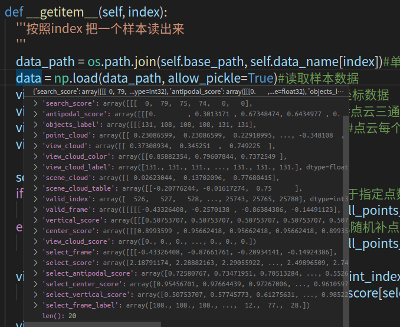
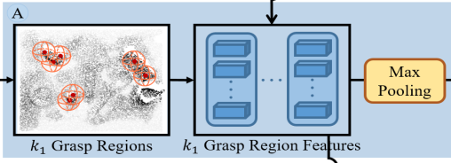
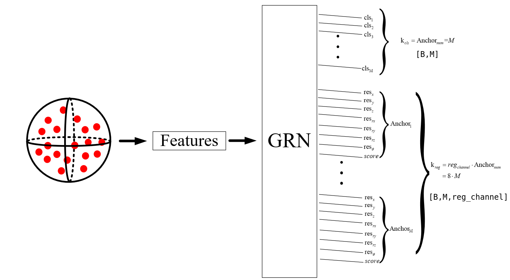
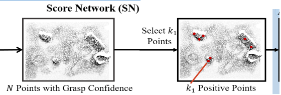
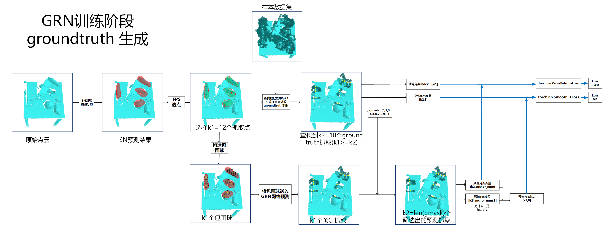

## 预训练scorenet

**数据集每一帧点云被统一剪切到25600个场景点**，在仅仅预先训练scorenet的时候，使用到的数据与lable分别为：

```python
        view = data['view_cloud'].astype(np.float32)#点云三通道坐标数据
        view_color = data['view_cloud_color'].astype(np.float32)#点云三通道颜色数据
        view_score = data['view_cloud_score'].astype(np.float32)#点云每个点的0/1分数，构成一个分割mask()
        view_label = data['view_cloud_label'].astype(np.float32)#
```


## GRN训练细节

### ground truth设置细节

按照普遍的想法，如果我们希望GRN网络最终预测出k1个抓取，那么考虑可以在数据集中仅仅给定k1个ground truth即可；然而，在实际训练时，固定一个k1可能效果并不好，我们需要能够去不断的调整k1来找到最好的预测效果。

REGNet实现了可以自己设定k1的具体值，在训练GRN网络之前，可以人为设定从一帧点云中取出k1个抓取中心点，之后，GRN将会回归出指定的k1个抓取点；同时，在训练时，也需要得到以这k1个点作为中心点的ground truth抓取，以此来计算预测出的k1个抓取与k1个ground truth之间的抓取；

 

每一帧点云的groundtruth抓取数量是可以在每一次训练之前改动的，而并非是固定数量的，这点是如何做的到的呢？

实际上，给定的数据集中，存在的groundtruth是非常多的，而在训练的时候，只是从中挑出与k1个点位置相对应的抓取作为groundtruth而已；


### GRN抽取包围球特征与残差回归

一个网络是每单个样本进行预测的，但是也可以同时处理一个batch的数据，加快训练，网络的输出是针对一个样本的，因此在看网络的时候，要问一问自己，该网络处理的一个样本数据是什么。

在训练整体的REGnet时，一个batch样本，样本本身是一帧点云；而在训练GRN特征提取网络时，该子模块的单个样本则是一个包围球内的点云。

一个完整的REGnet网络，处理的单样本是一帧点云，但是在GRN部分，如下图，该子网络处理的样本则是一个包围球内部的点云：



该部分预测网络的初始化

```python
#利用包围球内点特征，回归抓取位置姿态残差与分数
self.extrat_feature_region = PointNet2TwoStage(
    num_points=group_num, #包围球内点数
    input_chann=6, #点云通道数xyzrgb
    k_cls=self.anchor_number,#每个中心点对应M个anchor
    k_reg=self.reg_channel*self.anchor_number,#同时回归出M个anchor抓取的每个通道的res残差
    k_reg_theta=self.anchor_number)  #回归出theta的残差
```

它此时是以单个包围球内部的多个点特征 作为一个样本，对内部的参数做进一步具体的分析：

- `num_points`  统一限定每个包围球内部的点数

- `input_chann`   包围球内部点的通道数

- `k_cls`  每一个包围球将回归出k_cls=M个抓取

- self.reg_channel=8  每个anchor对应的抓取，需要回归出一个8维度的向量，记为
  $$
  reg\_anchor = (res_x,res_y,res_z,res_{rx},res_{ry},res_{rz},res_\theta,score)
  $$
  但是注意，anchor本身只有7个维度，只有$ (res_x,res_y,res_z,res_{rx},res_{ry},res_{rz},res_\theta)$

- `k_reg_theta`  每个anchor额外回归出一个$res_\theta$  但是实际上没有用到，而是在上面统一回归了


以上的推论可以从该子网络的前向传播函数的输入数据看出来：

```python
x_cls, x_reg, mp_center_feature = self.extrat_feature_region(pc_group_features.permute(0,2,1), None) #pc_group_features:[B*N_C, N_G, feature_len] 
```

这里的一个batch将含有$B*N_C$ 个包围球，即$batch\_size =B*N_C $

每个包围球（抓取中心点）预设有M个anchor，该子网络将对这M个anchor进行分类，该部分的示意图如下




每一帧点云，获取的k1个ground truth抓取，并不是每个抓取都是适合抓取的“正抓取”，不正确的“negtive grasp”，分数会被设置为`-1`,

数据集中的groundtruth 坐标系的center是bottom_center


## 如何为GRN网络制作ground truth

ground truth不等同于数据集，ground truth只是数据集中的某些值；ground truth不一定都是正抓取，有可能是负抓取。



问题：

选定了k1个抓取点之后，这k1个点将会作为抓取中心点进一步回归出最终的候选抓取，那么如何为这k1个抓取点计算分配对应的ground truth抓取呢？

如果k1个抓取点附近没有groundtruth抓取怎么办呢？

如果这k1个抓取点对应的ground truth抓取分数很低，是非法抓取怎么办呢？需要处理么？允许在数据集中存在这样低的抓取么？

思路：

并不是给定的样本中只有k1个点，并且k1个点对应的位置姿态是确定的，网络必须回归出这k1个点坐标与抓取姿态分数，然后记录loss

而是样本有多个点，从中挑出与k1最近的ground truth抓取，


样本不是说，我只有这么多个东西，网络你只能按照我给定的东西走

而是，网络你可以回归出一些点，你可以回归，我根据你出来的值，去数据集中查查，根据你的值查查看是不是正确的



上图中，选择的训练batch_size = 1，

另外，len(gmask)针对的是一个batch的点云中的所有抓取中心点的mask


这个选点、分配ground truth抓取算法的实现函数为：

```python
def get_grasp_allobj(pc, predict_score, params, data_paths, use_theta=True):
```

假设当前点云通过Antipodal计算，得到了1000个ground truth候选抓取；通过算法筛选到一共有k1个候选抓取中心点；

1. 计算k1中每个点与1000个抓取中心的距离distance，形状是[k1,1000] 
2. 根据距离找到k1中每个点与哪个点的中心点距离最近，记录下那些groundtruth抓取中心点的编号
3. 利用这些最近抓取中心点的编号，筛选出最近抓取的位置姿态以及分数
4. 如果某点与最近抓取中心点的距离大于5mm，就认为该FPS选点没有合法抓取，位姿、分数、等都设置为-1，例如图中$P_1,P_2$ 点处，在数据集中没有找到与之距离为5mm之内的抓取，但是它们同样会给出一个抓取，但是所有值都被置为-1，代表该处没有合理抓取。
5. 根据上面的抓取位置姿态和分数，返回ground truth抓取向量


REGnet代码中，可选的groundtruth抓取向量有两种，8维度向量与10维度抓取向量

```python
#8维度
grasp_labels        :[B, center_num, 8] the labels of grasps (center[3], axis_y[3], grasp_angle[1], grasp_score[1])
#10维度
grasp_labels        :[B, center_num, 8] the labels of grasps (center[3], axis_y[3], grasp_angle[1], grasp_score[1],antipodal_score[1],center_score[1])
```


如何知道ground truth抓取，与哪个预设anchor比较近呢？在哪里实现的？在GRN的computer_loss函数中实现的


REGNet预测出的抓取坐标系，是那种形式？是dex标准的典范坐标系么？


